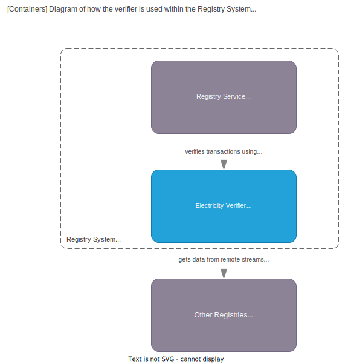

# OriginElectricity

This file contains a overview of the `Electricity Verifier`

## What is a verifier?

In ProjectOrigin a registry users a verifier to verify a transaction within a namespace.

A verifier is a sidecar container running next to the registry container.
The verifier is responsible for verifying the transaction and returning the result to the registry.

Below is a diagram of how the verifier fits into the [OriginRegistry system](../registry/index.md)

## Electricity Verifier

The electricity verifier is a verifier that verifies the electricity transaction based on the rule set from
[Energy Track & Trace](https://energytrackandtrace.azurewebsites.net).
